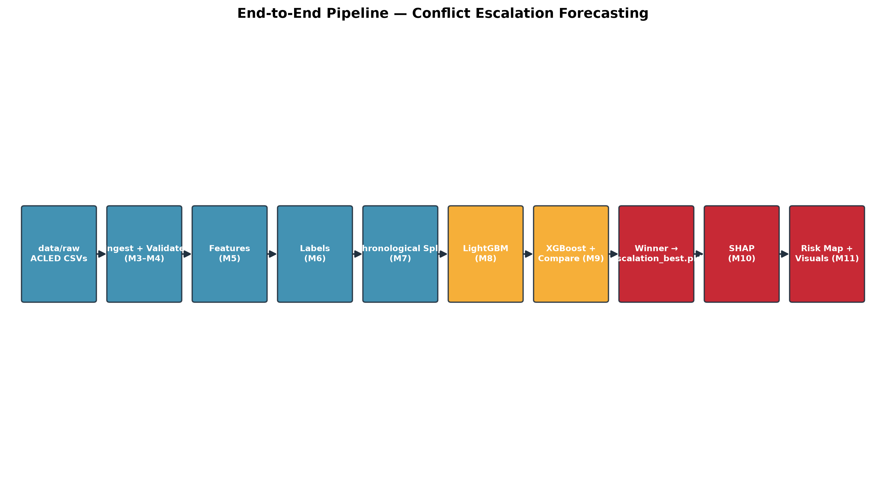
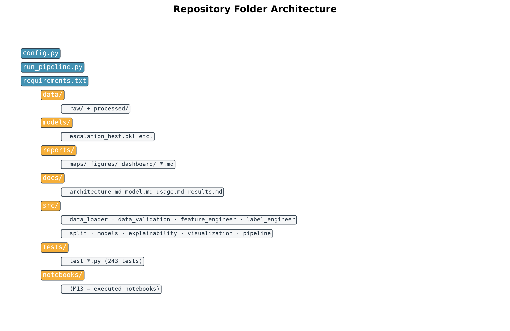
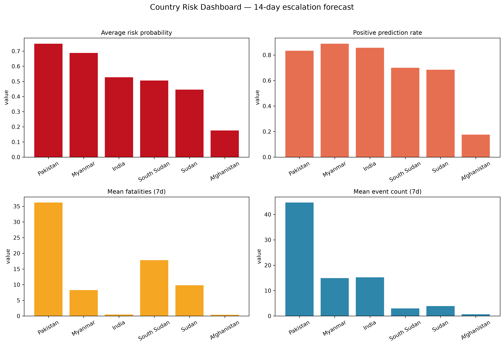
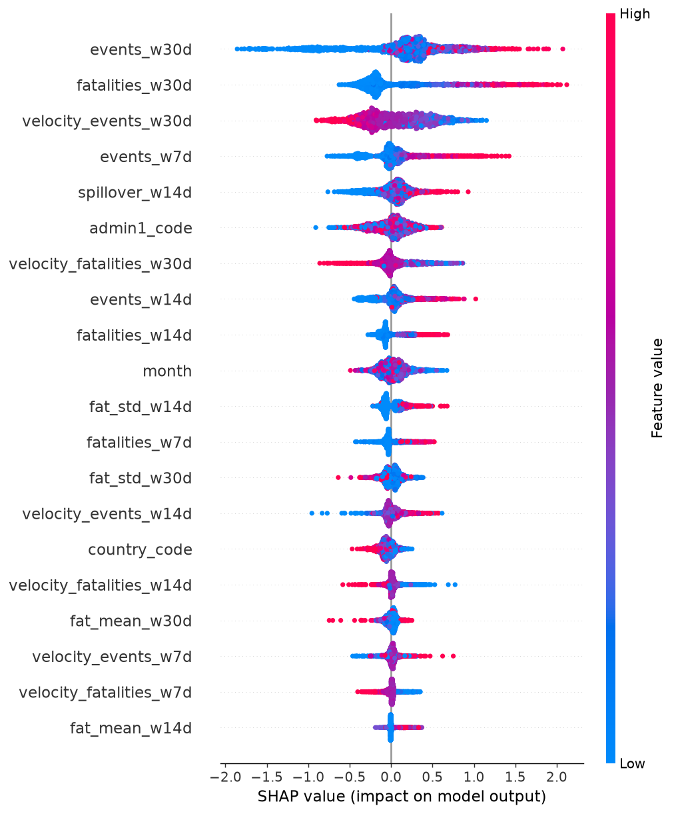

# Conflict Escalation Forecasting — District-Level 14-Day Risk Prediction

**A reproducible machine-learning early-warning system that forecasts conflict escalation risk at the geo-unit (province) level across South Asia, Sudan, and South Sudan — 14 days ahead — using ACLED event data.**

[](https://www.python.org/)
[](https://lightgbm.readthedocs.io/)
[](https://xgboost.readthedocs.io/)
[](https://shap.readthedocs.io/)
[](#tests)
[](#tests)

---

## Project Overview

Conflict monitoring today is largely **reactive**: analysts see a spike in violence and respond after the fact. This project turns historical ACLED event patterns into a **forward-looking, geo-unit-level risk signal** that answers:

> **Which provinces are most likely to see conflict escalation — a significant rise in violent events or fatalities — within the next 14 days?**

The system is an end-to-end machine-learning pipeline that:

1. Ingests and validates ACLED weekly aggregated event data for **6 countries** (India, Pakistan, Afghanistan, Myanmar, Sudan, South Sudan).
2. Engineers **leakage-safe rolling-window features** (7/14/30-day event & fatality counts, velocity, volatility, persistence, entropy, recency, spillover).
3. Builds **future-only escalation labels** with a 14-day prediction horizon.
4. Splits the data **strictly chronologically** (no shuffle, no leakage).
5. Trains and compares **LightGBM vs XGBoost** under identical conditions, with class-imbalance handling and threshold optimization.
6. Explains every prediction with **SHAP** (global importance, waterfall, dependence plots, local drivers).
7. Visualizes risk on an **interactive map** plus a full dashboard set (country trends, hotspots, temporal evolution, distributions).

This is a **machine-learning forecasting system** — not a dashboard or API — and the pipeline is the product.

---

## Problem Statement & Motivation

- **The problem:** violence clusters in space and time — past violence is the strongest predictor of future violence. Analysts need to know *where* and *when* risk is rising, not just what already happened.
- **The motivation:** an early-warning signal at province granularity supports humanitarian planning, media attention routing, and policy response *before* escalation, not after.
- **The framing:** a **binary classification** task over a rolling 14-day horizon — "will this geo unit escalate in the next 14 days?" — evaluated with time-respecting protocols (chronological split, PR-AUC, threshold analysis) and SHAP explainability.

---

## Features

- **Data ingestion & validation** — multi-file CSV discovery, schema canonicalization, 9 validation rules with descriptive exceptions, district master table.
- **Leakage-safe feature engineering** — half-open `[as_of − W, as_of)` windows, velocity, volatility, persistence, Shannon entropy, recency sentinel, calendar, deterministic identity codes, spatial spillover (K-nearest same-country units, haversine).
- **Future-only labels** — escalation defined on `(as_of, as_of + 14d]` observations only; incomplete future windows dropped, never partially labeled.
- **Strict chronological split** — date-axis quantile cuts, no shuffle, provably no temporal leakage.
- **Dual model training** — LightGBM and XGBoost on identical data/seed/imbalance handling; deterministic and reproducible.
- **Fair model comparison** — precision, recall, F1, PR-AUC, ROC-AUC, Brier, log-loss, confusion matrix; threshold sweep 0.10–0.90; 4 baselines (majority, always-positive, persistence, event-count heuristic); PRD-priority winner selection.
- **SHAP explainability** — global importance, beeswarm summary, waterfall plots (correct positive/negative/borderline), dependence plots, local top-K drivers, data-driven behaviour observations.
- **Risk visualization** — interactive folium risk map with per-unit popups, country dashboard (PNG + plotly HTML), hotspot ranking + heatmap, temporal trends, prediction distributions.
- **Logging everywhere** — rotating file + console, INFO/WARNING/ERROR.
- **Configuration-driven** — every path, threshold, seed, and hyperparameter lives in `config.py` (nothing hardcoded).

---

## System Architecture



**Layered design:**

| Layer | Modules | Responsibility |
|---|---|---|
| **Ingestion** | `src/data_loader.py`, `src/data_validation.py` | Read raw CSVs → validate → canonical cleaned events + district master |
| **Engineering** | `src/feature_engineer.py`, `src/label_engineer.py` | Leakage-safe features + future-only labels |
| **Modeling** | `src/split.py`, `src/models.py`, `src/pipeline.py` | Chronological split, LGBM/XGB training, comparison, winner selection |
| **Explainability** | `src/explainability.py` | SHAP on the held-out test window |
| **Visualization** | `src/visualization.py` | Risk map, dashboards, hotspots, temporal trends |
| **CLI / config** | `run_pipeline.py`, `config.py` | Stage orchestration and single source of truth |

All domain errors derive from `src/exceptions.py::ConflictForecastError`; every module logs through `src/logging_config.py`.

See **[docs/architecture.md](docs/architecture.md)** for full detail.

---

## End-to-End Pipeline

```
data/raw/*.csv (ACLED weekly aggregated, 127,353 rows)
   │  data_loader.load_csv_files()        # discovery + merge + canonicalize
   ▼
canonical events frame
   │  data_validation.validate_dataset()   # 9 rules + geo_unit + event_id
   ▼
cleaned_events (127,052 × 14) ──► district_master (124 × 9)
   │  feature_engineer.build_features()    # half-open [as_of−W, as_of) windows
   ▼
features (44,146 × 37) ──► feature_summary.md
   │  label_engineer.build_labeled_dataset()   # future-only (as_of, as_of+14d]
   ▼
labeled_features (43,981 × 38) ──► label_summary.md + label_timeline.png
   │  split.chronological_split()          # date-axis quantiles, no shuffle
   ▼
split_train (30,790) · split_val (6,522) · split_test (6,669)
   │  models.train_model(family="lightgbm") + compare_stage (XGBoost)
   ▼
escalation_best.pkl (= XGBoost) ──► model_comparison.json/.md
   │  explain_stage()  # TreeExplainer on the held-out test window
   ▼
reports/shap_summary.md + reports/shap/ (21 plots)
   │  visualize_stage()
   ▼
reports/maps/risk_map.html + reports/figures/ + reports/risk_summary.md
```

---

## Folder Structure



```
army/
├── config.py                  # Single source of truth (paths, scope, rules, thresholds, seeds, model params)
├── run_pipeline.py            # CLI: --stage ingest | features | labels | split | train | compare | explain | visualize | forecast | all
├── requirements.txt           # Exact-pinned dependencies
├── pytest.ini / .gitignore / .env.example
├── IMPLEMENTATION_PLAN.md     # Approved milestone plan + adaptation notes
├── PROGRESS.md                # Live project progress log
├── PRD.md                     # Product requirements document
├── data/
│   ├── README.md              # Data provenance + attribution
│   ├── raw/                   # ACLED weekly aggregated CSV (127,353 rows) — gitignored
│   └── processed/             # cleaned_events · district_master · features · labeled_features · split_{train,val,test}
├── models/                    # escalation_{lgbm,xgb,best}.pkl · manifest.json · model_comparison.json — .pkl gitignored
├── reports/                   # *.md summaries + figures/ + maps/ + dashboard/ + shap/ (21 plots)
├── docs/                      # This documentation set + images
│   ├── architecture.md · model.md · usage.md · results.md
│   └── images/                # diagrams + screenshots
├── scripts/
│   └── generate_diagrams.py   # Regenerates docs/images diagrams
├── src/
│   ├── logging_config.py      # Rotating file + console logging
│   ├── exceptions.py          # ConflictForecastError hierarchy
│   ├── data_loader.py         # Adaptive CSV discovery, merge, canonicalize, save
│   ├── data_validation.py     # 9 validation rules + district master + orchestrator
│   ├── feature_engineer.py    # Leakage-safe rolling-window features
│   ├── label_engineer.py      # Future-only escalation labels
│   ├── split.py               # Strict chronological train/val/test
│   ├── models.py              # LGBM + XGB train/save/load, imbalance, metrics, baselines, winner
│   ├── explainability.py      # SHAP importance/plots/local explanations
│   ├── visualization.py       # Risk map, dashboards, hotspots, temporal trends
│   ├── forecast.py            # LIVE next-14-days forecast (--stage forecast)
│   └── pipeline.py            # Orchestration: train_stage + compare_stage + explain_stage
├── tests/                     # 243 pytest tests across 10 modules
└── notebooks/                 # Reserved for executed EDA/feature/modeling notebooks (M13)
```

---

## Dataset

**Source:** [ACLED — Armed Conflict Location & Event Data Project](https://acleddata.com) (acleddata.com). Data was downloaded manually via the ACLED Data Export Tool on **2026-08-07** and placed in `data/raw/` (no API code in the pipeline, per project decision).

**Scope:** India, Pakistan, Afghanistan, Myanmar, Sudan, South Sudan — weekly aggregated admin-1 (province) counts, 2017-01-01 → 2026-08-07.

| Dataset | Rows | Columns | Notes |
|---|---|---|---|
| raw CSV | 127,353 | 12 | weekly buckets 2016-12-31 → 2026-07-25 |
| cleaned_events | 127,052 | 14 | 6 countries · 124 geo units · 0 missing · 0 duplicates |
| district_master | 124 | 9 | per-unit admin1, country, centroids, totals |
| features | 44,146 | 37 | 0 NaN · 0 duplicates |
| labeled_features | 43,981 | 38 | 30,217 positive (68.7%) / 13,764 negative |
| split_train / val / test | 30,790 / 6,522 / 6,669 | 38 | chronological, no overlap |

> **Adaptation note:** the source is a *weekly aggregated* export (week × country × admin1 × event_type with `events`, `fatalities`, centroid coordinates), so `geo_unit` = `admin1` (province level) and `event_id` is a composite key. An event-level export (with `event_id_cnty`, `admin2`, `actor1`) is a **drop-in swap** — the loader detects it automatically.

---

## Feature Engineering

All features are computed **per geo unit, in chronological order, using only past information** (`[as_of − W, as_of)` — the current day is excluded). **No feature ever sees future rows.**

| Group | Features |
|---|---|
| Event counts + log1p | `events_{7,14,30}d`, `events_log1p_{7,14,30}d` |
| Fatality counts + log1p | `fatalities_{7,14,30}d`, `fatalities_log1p_{7,14,30}d` |
| Velocity | `velocity_events_{7,14,30}d`, `velocity_fatalities_{7,14,30}d` (current − prior window) |
| Fatality statistics | `fat_mean_{14,30}d`, `fat_std_{14,30}d` |
| Persistence | `persistence_w7d` (active days in last 7) |
| Event-type diversity | `entropy_{7,14,30}d` (Shannon) |
| Recency | `days_since_event` (sentinel 999 when no history) |
| Calendar | `month`, `day_of_week` |
| Identity | `country_code`, `admin1_code`, `geo_unit_code` (deterministic) |
| Spatial spillover | `spillover_w14d` (events across the K=3 nearest same-country units) |

33 features are used by the models. **Leakage is proven** by tests: a spike injected *after* a prediction date never changes features at that date, and a randomized property test confirms feature values depend only on strictly-past rows.

---

## Label Generation

Binary target, **14-day horizon**, using **only future observations**:

> **`escalation = 1`** iff, during `(as_of, as_of + 14d]`:
> - `future_events ≥ 3` **AND** `future_events ≥ 1.5 × trailing-30d median`, **OR**
> - `future_fatalities ≥ 5`
>
> Absolute fallback: `future_events ≥ 5` when the unit has no trailing history.

- Labels use **only** rows strictly after `as_of`; features use **only** rows strictly before it — complete temporal separation.
- Units whose 14-day future window extends past the data end are **dropped** (134 rows), never partially labeled.
- Result: **68.7% positive** (30,217 / 43,981) — see [docs/model.md](docs/model.md) for how imbalance is handled.

---

## Train / Validation / Test Methodology

- **Strictly chronological** split over the date axis at quantiles 70/15/15 (**no shuffle, no random CV**).
- Contiguous, non-overlapping date ranges; boundaries are validated (`max(train) < min(val) < min(test)`).

| Split | Rows | Date range | Positive % |
|---|---|---|---|
| Train | 30,790 | 2016-12-31 → 2023-09-02 | 69.2% |
| Validation | 6,522 | 2023-09-09 → 2025-02-01 | 67.7% |
| Test | 6,669 | 2025-02-08 → 2026-07-11 | 67.3% |

The **test window is never touched** during training, comparison, or winner selection (a poisoned-split test proves isolation).

---

## Model Comparison & Final Selection

Both models train on **identical** features, splits, seed (42), and `scale_pos_weight` imbalance handling.

| Metric (validation) | LightGBM | **XGBoost (winner)** |
|---|---|---|
| Best-F1 threshold | 0.20 | **0.25 (operating)** |
| **F1 @ best threshold** | 0.8400 | **0.8423** |
| PR-AUC | 0.9004 | **0.9031** |
| ROC-AUC | 0.8112 | **0.8175** |
| Brier | **0.1743** | 0.1755 |
| Log loss | **0.5145** | 0.5171 |
| F1 @ 0.5 | 0.7928 | 0.7803 |

**Winner:** XGBoost, selected by the PRD priority **F1 → PR-AUC → Brier** (validation F1 0.8423 > 0.8400). The operating threshold **0.25** is the argmax-F1 point from a 0.10–0.90 sweep — not a default 0.5.

**Baselines (validation @ 0.5):** persistence F1 0.8261 · majority 0.8076 · always-positive 0.8076 · event-count heuristic 0.8044 — the winner **beats all four**.

Artifacts: `models/escalation_best.pkl` (+ `escalation_lgbm.pkl`, `escalation_xgb.pkl`), `models/model_comparison.json`, `reports/model_comparison.md`.

---

## SHAP Explainability

TreeExplainer SHAP values are computed on the **held-out test window** (the model is never retrained). Outputs under `reports/shap/` + `reports/shap_summary.md`:

- Global **mean-|SHAP| importance** ranking + beeswarm **summary plot** + bar plot
- **Waterfall plots** for representative correct-positive, correct-negative, and borderline predictions
- **Dependence plots** for the top-10 features
- **Local top-3 driver explanations** per representative row
- **Data-driven behaviour observations** (computed from the actual ranking)

**Top-10 drivers (mean |SHAP|):** `events_w30d` (0.478) · `fatalities_w30d` (0.414) · `velocity_events_w30d` (0.309) · `events_w7d` (0.177) · `spillover_w14d` (0.155) · `admin1_code` (0.152) · `events_w14d` (0.148) · `velocity_fatalities_w30d` (0.145) · `fatalities_w14d` (0.127) · `month` (0.114).

**Key observations:** 30-day windows dominate the signal (recent sustained violence drives escalation); spatial spillover ranks #5 → neighbourhood contagion matters; identity codes outweigh calendar features.

---

## Risk Visualization

`visualize_stage` produces the full presentation set on the test window (122 geo units):

- **Interactive risk map** — `reports/maps/risk_map.html` (folium): one marker per geo unit colored by risk category (Low / Medium / High / Critical) with radius ∝ probability; popups show geo unit, country, risk probability, predicted class, top-3 SHAP drivers, recent 7d events and fatalities.
- **Country dashboard** — `reports/figures/country_dashboard.png` (300 dpi) + interactive `reports/dashboard/country_dashboard.html` (plotly): average risk, positive rate, mean fatalities, mean events per country.
- **Hotspot analysis** — `reports/hotspots_ranking.csv` (top-20), `hotspots_bar.png`, `hotspots_heatmap.png` (weekly risk evolution).
- **Temporal trends** — weekly / monthly average risk, rolling evolution timeline, country-wise comparison.
- **Importance & distributions** — top-20 SHAP bar, category-wise contribution, prediction histogram + KDE, risk-category distribution.
- **`reports/risk_summary.md`** — highest-risk & safest regions, country averages, top drivers, interpretation.




---

## Results & Performance Metrics

Headline numbers (validation; operating threshold 0.25):

| Metric | Value |
|---|---|
| Winner | XGBoost |
| Validation F1 | **0.8423** |
| Precision / Recall | 0.771 / 0.928 |
| PR-AUC | **0.9031** |
| ROC-AUC | 0.8175 |
| Brier | 0.1755 |
| Log loss | 0.5171 |

**Test-window risk snapshot (122 geo units):** Critical 42 · High 23 · Medium 21 · Low 36. Highest-risk unit **Khyber Pakhtunkhwa (Pakistan, 0.999)**; safest **Zabul (Afghanistan, 0.026)**; country average risk: Pakistan 0.749 · Myanmar 0.688 · India 0.527 · South Sudan 0.505 · Sudan 0.445 · Afghanistan 0.176.

See **[docs/results.md](docs/results.md)** for the full analysis.

---

## Installation

### Prerequisites

- **Python 3.11+** (developed and verified on 3.14.3)
- `git`

### Setup (Windows / Linux / macOS)

```bash
# 1. Clone the repository
git clone <your-repo-url> army
cd army

# 2. Create and activate a virtual environment
python -m venv .venv
# Windows (bash / PowerShell)
.venv/Scripts/activate
# macOS / Linux
source .venv/bin/activate

# 3. Install exact-pinned dependencies
pip install -r requirements.txt

# 4. (Optional) copy the environment template
cp .env.example .env
```

> The pinned versions (numpy 2.4.6, pandas 3.0.5, lightgbm 4.7.0, xgboost 3.4.0, shap 0.52.0, scikit-learn 1.9.0, folium 0.20.0, plotly 6.9.0) were verified to install cleanly on Python 3.14.3.

### Data

Place your ACLED export(s) in `data/raw/` (see [data/README.md](data/README.md)). The loader auto-detects the weekly-aggregated and event-level formats.

---

## Running the Project

> **New to the project? Follow the complete step-by-step guide: [docs/RUN_PROJECT.md](docs/RUN_PROJECT.md)** — it covers prerequisites, cloning, environment setup, dataset placement, every command, expected outputs, verification, troubleshooting, and clean re-runs.

### Quick start (everything at once)

```bash
python run_pipeline.py --stage all   # runs all 9 stages in dependency order
```

### Or run stages individually

Each stage reads the previous stage's outputs and writes its own:

```bash
python run_pipeline.py --stage ingest     # raw CSVs → cleaned_events + district_master
python run_pipeline.py --stage features   # → features (rolling-window feature table)
python run_pipeline.py --stage labels     # → labeled_features (14-day escalation labels)
python run_pipeline.py --stage split      # → split_train / split_val / split_test
python run_pipeline.py --stage train      # LightGBM → models/escalation_lgbm.pkl
python run_pipeline.py --stage compare    # XGBoost + comparison → escalation_best.pkl
python run_pipeline.py --stage explain     # SHAP → reports/shap_summary.md + reports/shap/
python run_pipeline.py --stage visualize  # risk map + dashboards → reports/
python run_pipeline.py --stage forecast   # LIVE 14-day forecast → reports/forecast_next_14_days.csv + forecast_risk_map.html
```

The pipeline is deterministic: a clean re-run reproduces identical model artifacts and metrics.

### Tests

```bash
python -m pytest            # 243 tests
python -m pytest --cov=src  # with coverage (96.5% overall)
```

### Regenerate diagrams

```bash
python scripts/generate_diagrams.py
```

---

## Configuration

Everything is configurable in **[config.py](config.py)** — there are no hardcoded values in `src/`:

| Area | Keys (examples) |
|---|---|
| Paths | `DATA_RAW_DIR`, `DATA_PROCESSED_DIR`, `MODELS_DIR`, `REPORTS_DIR` |
| Scope | `COUNTRIES`, `DATE_START`, `DATE_END`, `MIN_EVENTS_PER_UNIT` |
| Validation | `REQUIRED_COLUMNS`, `DUPLICATES_MODE`, `MAX_DROPPED_FRACTION`, `LAT_MIN/MAX`, `LON_MIN/MAX` |
| Features | `ROLLING_WINDOWS`, `VELOCITY_WINDOWS`, `VOLATILITY_WINDOWS`, `SPILLOVER_*`, `RECENCY_SENTINEL` |
| Labels | `LABEL_HORIZON_DAYS`, `ESCALATION_MIN_EVENTS`, `ESCALATION_MULTIPLIER`, `ESCALATION_MIN_FATALITIES`, `ABSOLUTE_MIN_EVENTS`, `INCOMPLETE_WINDOW` |
| Split | `SPLIT_RATIOS`, `RANDOM_SEED`, `SPLIT_DATE_COLUMN` |
| Models | `LGBM_PARAMS`, `XGB_PARAMS`, `IMBALANCE_METHOD`, `THRESHOLD_MIN/MAX/STEP`, `OPERATING_THRESHOLD_MODE` |
| Explainability | `SHAP_SAMPLE_CAP`, `SHAP_TOP_N`, `SHAP_DEPENDENCE_TOP_K`, `SHAP_WATERFALL_COUNT` |
| Visualization | `RISK_LEVEL_BOUNDARIES`, `RISK_LEVEL_NAMES`, `RISK_LEVEL_COLORS`, `FIGURE_DPI`, `HOTSPOT_TOP_K`, `MAP_CENTER` |

`config.validate_config()` asserts internal consistency (e.g., risk bands sorted, threshold sweep grid exact, split ratios sum to 1) and is called at every pipeline run.

---

## Limitations

- **Province-level granularity** (admin-1): the source is a weekly aggregated export; an event-level ACLED export would restore district-level + actor features as a drop-in swap.
- **High positive-class rate (68.7%)** at this granularity: handled via threshold tuning (operating point 0.25) and PR-AUC as the headline metric; the F1 lift vs majority is ≈1.04×.
- **7-day windows at weekly granularity** = the previous week's bucket (documented adaptation).
- No actor columns in the aggregated export → actor-diversity features are skipped ("if available").
- Weekly data ⇒ finer daily dynamics are not representable.

See **[docs/usage.md](docs/usage.md)** for commands and expected outputs, **[docs/model.md](docs/model.md)** for the modeling details, and **[docs/results.md](docs/results.md)** for the full results.

---

## Future Work

- **Event-level ACLED export** → district-level geo units, actor-diversity features, per-event coordinates (drop-in).
- **Multi-horizon forecasting** (7d / 30d) and calibration curves per horizon (FR-15).
- **Spillover tuning** — richer neighbourhood graphs, distance-decay weighting, cross-border units.
- **Threshold sensitivity & label-definition ablation** in the report.
- **Daily refresh** of predictions once fresh ACLED exports land in `data/raw/` (no retraining needed for scoring).
- **Notebooks (M13)** — executed EDA, feature-engineering, and modeling notebooks for the hackathon submission.

---

## Contributors

- **Project team** — Conflict Escalation Forecasting hackathon (2026). *(Update with your names.)*

Built with a milestone-driven workflow — see [IMPLEMENTATION_PLAN.md](IMPLEMENTATION_PLAN.md) and [PROGRESS.md](PROGRESS.md).

---

## License

MIT License — see the repository for details. *(Adjust as needed before submission.)*

---

## Attribution

**Data:** ACLED (Armed Conflict Location & Event Data Project), acleddata.com. Data used under ACLED's academic-use terms; please cite ACLED in any publication or presentation: *ACLED (2026), Armed Conflict Location & Event Data (ACLED) [dataset], accessed 2026-08-07 via acleddata.com.* See [data/README.md](data/README.md) for provenance details.
