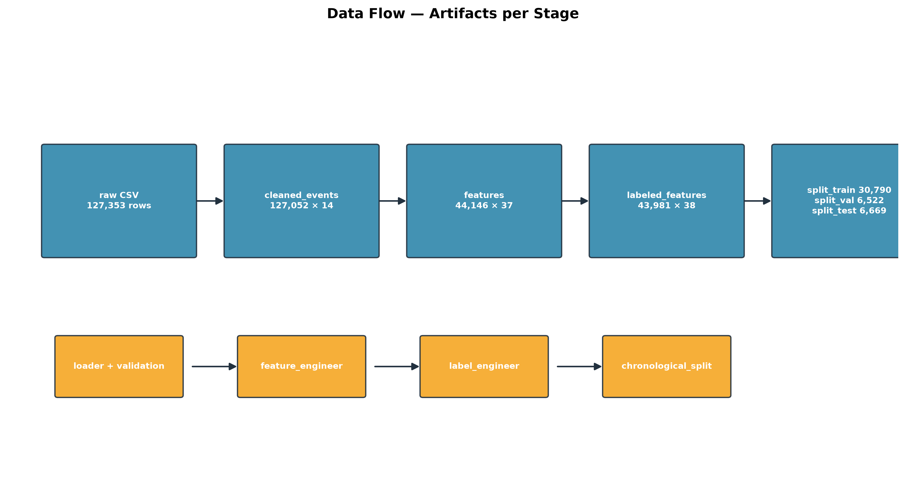

# Architecture

This document explains the project's architecture, module interactions, data flow, pipeline stages, and the key design decisions behind them.

---

## 1. High-Level Architecture

The system is a **layered, stage-based pipeline**. Each stage is an independent module with a single responsibility, orchestrated by `run_pipeline.py` (CLI) and connected only through files on disk (`data/processed/*.parquet`, `models/*.pkl`, `reports/*`).


| Layer | Modules | Responsibility | Key outputs |
|---|---|---|---|
| Ingestion & quality | `src/data_loader.py`, `src/data_validation.py` | Discover/merge raw CSVs, canonicalize the schema, enforce 9 validation rules, build the district master | `cleaned_events`, `district_master` |
| Feature engineering | `src/feature_engineer.py` | Leakage-safe rolling-window features per geo unit | `features` (37 cols) |
| Label engineering | `src/label_engineer.py` | Future-only escalation labels (14-day horizon) | `labeled_features` (38 cols) |
| Modeling | `src/split.py`, `src/models.py`, `src/pipeline.py` | Chronological split, LGBM/XGB training, fair comparison, winner selection | `split_{train,val,test}`, `escalation_best.pkl`, `model_comparison.json` |
| Explainability | `src/explainability.py` | SHAP on the held-out test window | `reports/shap/*`, `reports/shap_summary.md` |
| Visualization | `src/visualization.py` | Risk map, dashboards, hotspots, temporal trends | `reports/maps/*`, `reports/figures/*`, `reports/risk_summary.md` |
| Cross-cutting | `config.py`, `src/logging_config.py`, `src/exceptions.py` | Single source of truth, logging, error hierarchy | — |

---

## 2. Module Interaction

```
                    ┌─────────────────────────── config.py ───────────────────────────┐
                    │  paths · scope · thresholds · seeds · hyperparameters · rules    │
                    └─────────────────────────────────────────────────────────────────┘
                                          ▲ read by every module
                                          │
run_pipeline.py (CLI) ── calls ──► src/pipeline.py orchestrators
  │                                        │
  ├─ ingest   ──► data_loader ──► data_validation
  ├─ features ──► feature_engineer
  ├─ labels   ──► label_engineer
  ├─ split    ──► split
  ├─ train    ──► models.train_model          (LightGBM)
  ├─ compare  ──► models (XGB) + pipeline.compare_stage
  ├─ explain  ──► explainability.explain_stage
  └─ visualize ─► visualization.visualize_stage

Every module:
  - logs through src/logging_config.py          → logs/project.log
  - raises src.exceptions.ConflictForecastError → descriptive domain errors
  - validates its inputs and re-raises with context
```

**Reuse rules:** public functions from one module are imported by another only when ownership is clear — e.g. `visualization.py` reuses `explainability.load_winning_model`, `explainability.compute_shap_values`, and `explainability._operating_threshold` (single source of truth for the threshold), and `pipeline.py` reuses `models.*` for all training. No duplicated training/metrics logic exists.

---

## 3. Data Flow



```
data/raw/*.csv ──► data_loader ──► data_validation ──► data/processed/cleaned_events.parquet
                                                          └──► district_master.parquet
cleaned_events ──► feature_engineer ──► data/processed/features.parquet
features ──► label_engineer ──► data/processed/labeled_features.parquet
labeled_features ──► split ──► split_train.parquet · split_val.parquet · split_test.parquet
splits ──► models ──► models/escalation_{lgbm,xgb,best}.pkl + manifest.json
test split + winner ──► explainability ──► reports/shap/* + shap_summary.md
test split + winner ──► visualization ──► reports/maps/risk_map.html + reports/figures/* + risk_summary.md
```

**Key property:** stages communicate only through validated artifacts on disk. This makes the pipeline resumable (each `--stage` reads its predecessor's output), testable in isolation, and inspectable at every boundary.

---

## 4. Pipeline Stages

| Stage | CLI | Reads | Writes | Purpose |
|---|---|---|---|---|
| ingest | `--stage ingest` | `data/raw/*.csv` | `cleaned_events`, `district_master` | Validate + canonicalize raw data |
| features | `--stage features` | `cleaned_events.parquet` | `features` (+`feature_summary.md`) | Leakage-safe rolling features |
| labels | `--stage labels` | `features.parquet` + `cleaned_events.parquet` | `labeled_features` (+`label_summary.md`) | Future-only escalation labels |
| split | `--stage split` | `labeled_features.parquet` | `split_{train,val,test}` (+`split_summary.md`) | Chronological train/val/test |
| train | `--stage train` | `split_train/val` | `escalation_lgbm.pkl`, `manifest.json` | Train LightGBM |
| compare | `--stage compare` | `split_train/val` + LGBM artifact | `escalation_xgb.pkl`, `escalation_best.pkl`, `model_comparison.json/.md` | Train XGBoost, compare, select winner + threshold |
| explain | `--stage explain` | `split_test` + winner | `reports/shap/*`, `shap_summary.md` | SHAP explainability |
| visualize | `--stage visualize` | `split_test` + winner + `cleaned_events` | `reports/maps/*`, `reports/figures/*`, `reports/dashboard/*`, `risk_summary.md` | Risk map + dashboard set |

---

## 5. Design Decisions

1. **Stage-per-milestone decomposition.** Each PRD milestone maps to exactly one module + one CLI stage, so the system grew incrementally and each stage is independently verifiable (tests, gates, artifacts).

2. **File-based stage boundaries (not in-memory coupling).** Intermediate results are persisted as parquet + CSV. Benefits: reproducibility, resumability, inspectability; costs: disk usage (acceptable at this scale).

3. **Strict temporal separation by construction.** Features use half-open windows `[as_of−W, as_of)`; labels use `(as_of, as_of+14d]`; the split is a chronological date-axis cut with no shuffle; the test split is never read during training or winner selection. Leakage is *proven* by dedicated tests, not assumed.

4. **One source of truth for configuration.** `config.py` holds every threshold, path, seed, and hyperparameter. `validate_config()` runs at pipeline start so misconfiguration fails fast with a descriptive error.

5. **Headless-safe plotting.** All plotting modules force the matplotlib `Agg` backend at import, use `show=False`, and save to files — the pipeline runs on servers/CI with no display. Interactive artifacts (folium, plotly) are written as self-contained HTML.

6. **Determinism.** Fixed seed (42), no randomness in splitting, feature coding, or SHAP sampling (even-spaced indices). Retraining reproduces identical metrics — proven by a determinism test.

7. **Error transparency.** Every domain error derives from `ConflictForecastError` and names the offending file/column/value. No `except: pass`, no silent drops (missing values, duplicates, and incomplete label windows are either handled with a logged policy or raise).

8. **Documentation-as-artifact.** `docs/*.md` and the diagrams are regenerable (`scripts/generate_diagrams.py`) and kept in sync with the implementation; PROGRESS.md tracks milestone status.
