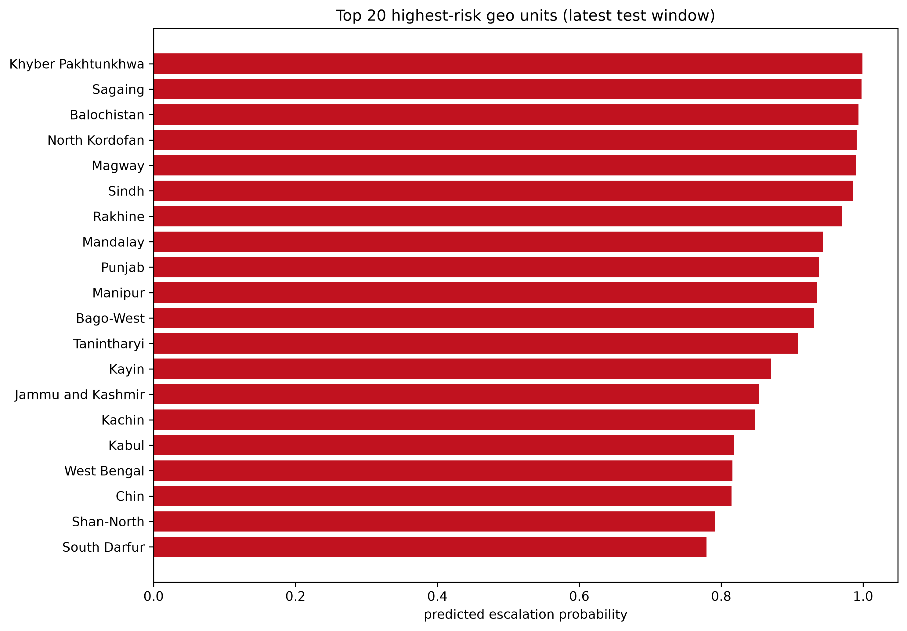
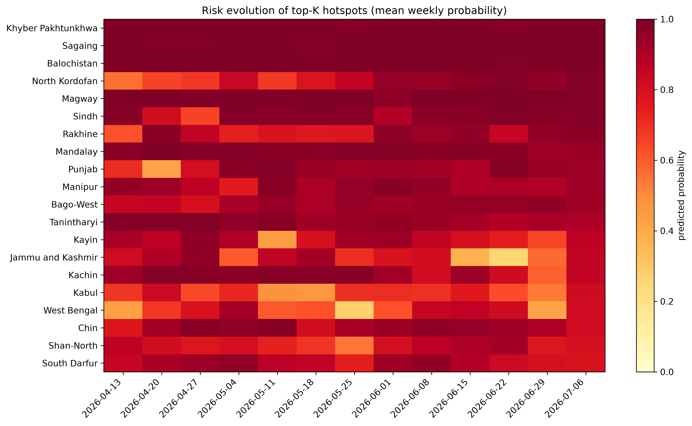
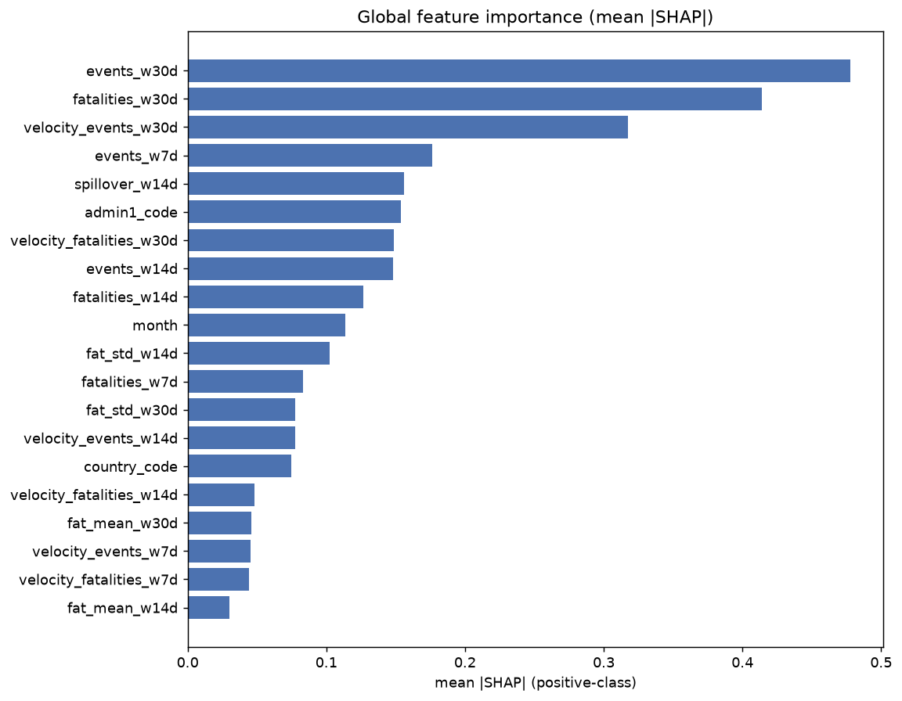
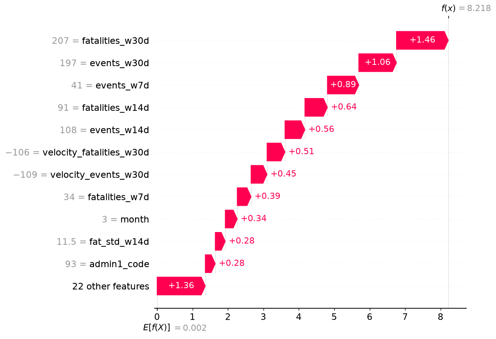
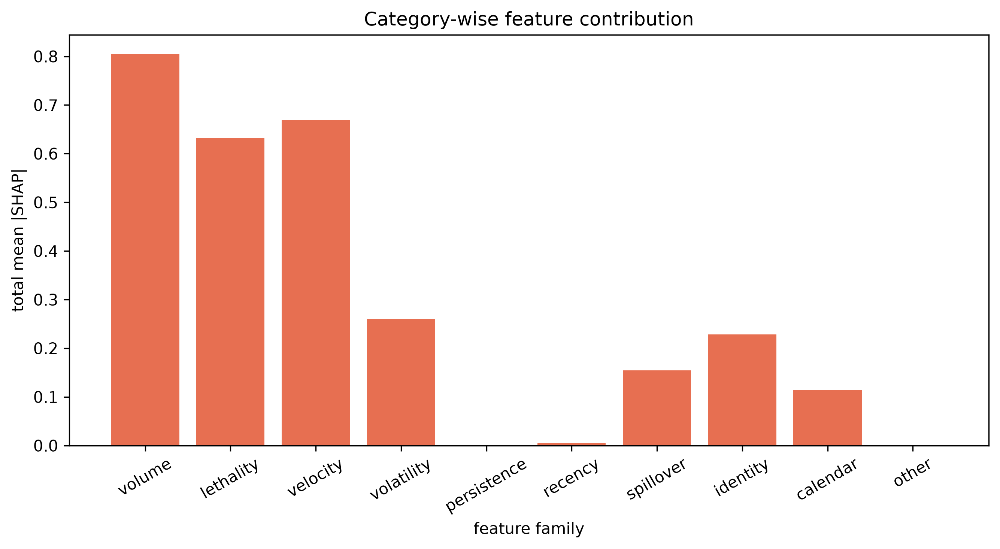
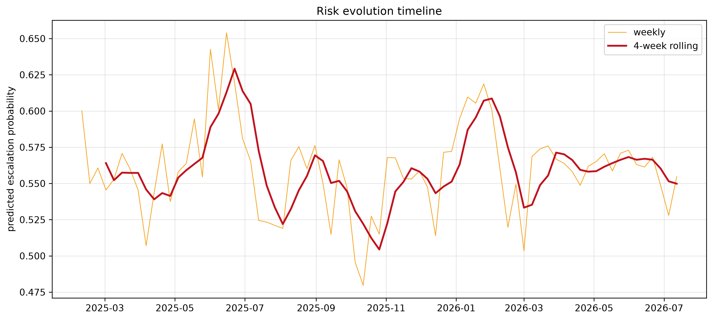
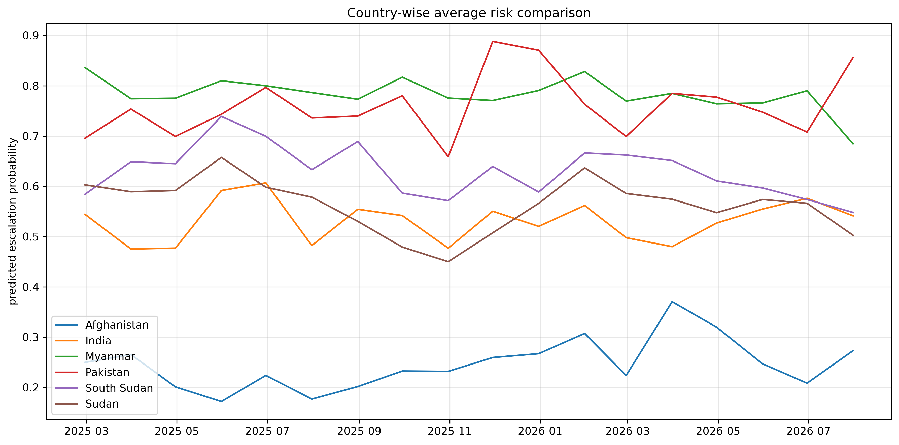
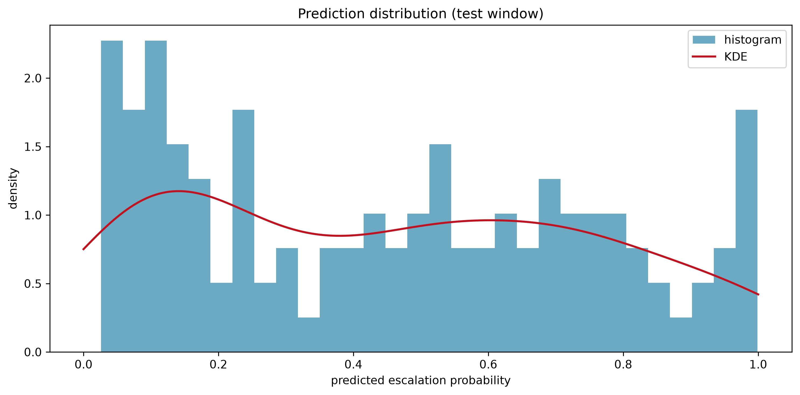
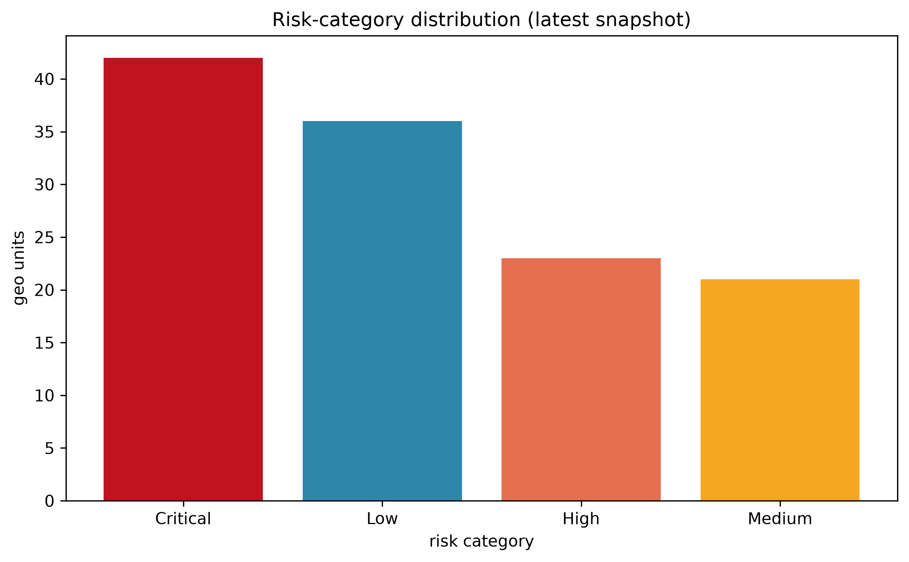

# Results

This document summarizes the project's results: final metrics, model comparison, hotspot analysis, key findings, and screenshots. Every number comes from the implemented pipeline (`reports/`, `models/model_comparison.json`).

---

## 1. Final Metrics (validation, operating threshold 0.25)

| Metric | LightGBM @0.20 | **XGBoost (winner) @0.25** |
|---|---|---|
| **F1** | 0.8400 | **0.8423** |
| Precision | 0.753 | **0.771** |
| Recall | 0.950 | **0.928** |
| PR-AUC | 0.9004 | **0.9031** |
| ROC-AUC | 0.8112 | **0.8175** |
| Brier | **0.1743** | 0.1755 |
| Log loss | **0.5145** | 0.5171 |
| F1 @ default 0.5 | 0.7928 | 0.7803 |

**Winner:** XGBoost (validation F1 0.8423 > 0.8400; PR-AUC 0.9031 > 0.9004). Operating threshold **0.25** = argmax-F1 from the 0.10–0.90 sweep.

---

## 2. Baselines Comparison (validation)

| Baseline | F1 | PR-AUC | Beaten by winner? |
|---|---|---|---|
| Majority / always-positive | 0.8076 | 0.6772 | ✅ |
| Event-count heuristic | 0.8044 | 0.7741 | ✅ |
| Persistence | 0.8261 | 0.7557 | ✅ |
| **XGBoost (winner)** | **0.8423** | **0.9031** | — |

The winner beats all four baselines; the strongest heuristic (persistence) is improved by ≈1.6 F1 points and ≈0.15 PR-AUC.

---

## 3. Test-Window Risk Snapshot

Predictions on the **held-out test window** (2025-02-08 → 2026-07-11, 6,669 rows, 122 geo units), latest assessment per unit:

**Risk categories:** Critical 42 · High 23 · Medium 21 · Low 36.

### Highest-risk regions (top 10)

| Rank | Geo unit | Country | Probability | Category |
|---|---|---|---|---|
| 1 | Khyber Pakhtunkhwa | Pakistan | 0.999 | Critical |
| 2 | Sagaing | Myanmar | 0.998 | Critical |
| 3 | Balochistan | Pakistan | 0.993 | Critical |
| 4 | North Kordofan | Sudan | 0.991 | Critical |
| 5 | Magway | Myanmar | 0.991 | Critical |
| 6 | Sindh | Pakistan | 0.986 | Critical |
| 7 | Rakhine | Myanmar | 0.970 | Critical |
| 8 | Mandalay | Myanmar | 0.943 | Critical |
| 9 | Punjab | India | 0.938 | Critical |
| 10 | Manipur | India | 0.935 | Critical |

### Safest regions (bottom 5)

| Rank | Geo unit | Country | Probability | Category |
|---|---|---|---|---|
| 1 | Zabul | Afghanistan | 0.026 | Low |
| 2 | Kunduz | Afghanistan | 0.028 | Low |
| 3 | Lakshadweep | India | 0.032 | Low |
| 4 | Abyei | Sudan | 0.037 | Low |
| 5 | Samangan | Afghanistan | 0.038 | Low |

### Average risk by country

| Country | Avg risk | Positive rate | Mean events (7d) | Mean fatalities (7d) |
|---|---|---|---|---|
| Pakistan | 0.749 | 0.833 | 44.7 | 36.2 |
| Myanmar | 0.688 | 0.889 | 14.9 | 8.3 |
| India | 0.527 | 0.857 | 15.3 | 0.5 |
| South Sudan | 0.505 | 0.700 | 3.0 | 17.8 |
| Sudan | 0.445 | 0.684 | 3.9 | 9.8 |
| Afghanistan | 0.176 | 0.176 | 0.7 | 0.4 |

---

## 4. Hotspot Analysis





The top-20 ranking (`reports/hotspots_ranking.csv`) is dominated by Pakistani and Myanmar provinces, with Sudan's North Kordofan and India's Punjab/Manipur also flagged Critical. The heatmap shows these hotspots' weekly risk evolution across the trailing 12 weeks of the test window.

---

## 5. SHAP Explainability






**Top-10 drivers (mean |SHAP|):** `events_w30d` (0.478) · `fatalities_w30d` (0.414) · `velocity_events_w30d` (0.309) · `events_w7d` (0.177) · `spillover_w14d` (0.155) · `admin1_code` (0.152) · `events_w14d` (0.148) · `velocity_fatalities_w30d` (0.145) · `fatalities_w14d` (0.127) · `month` (0.114).

**Category-wise contribution:**



The model leans on **sustained 30-day volume/lethality** and **spatial spillover**, with unit baselines second — a sensible early-warning profile: provinces with high recent violence and violent neighbours escalate.

---

## 6. Temporal Trends





Weekly/monthly average risk and the rolling evolution timeline (`reports/figures/temporal_*.png`) show how predicted risk moves over the test window; the country-wise comparison shows Pakistan and Myanmar persistently above the others while Afghanistan stays low.

---

## 7. Country Dashboard & Prediction Distribution






The interactive versions live at `reports/maps/risk_map.html` (folium, 122 markers with popups) and `reports/dashboard/country_dashboard.html` (plotly, 4 metrics per country).

---

## 8. Key Findings

1. **Sustained violence, not last week, drives escalation.** 30-day windows dominate SHAP importance — escalation risk is a *multi-week* phenomenon at this granularity.
2. **Spatial contagion is real.** `spillover_w14d` ranks #5; a province's neighbours measurably raise its risk.
3. **Threshold matters.** The majority-positive label (68.7%) makes 0.5 suboptimal; the argmax-F1 operating threshold (0.25) lifts validation F1 from 0.793 → 0.842.
4. **XGBoost marginally outperforms LightGBM** on F1 and PR-AUC on identical data; both beat all four baselines.
5. **Pakistan and Myanmar lead risk** in the test window (avg risk 0.749 / 0.688); Afghanistan is the safest of the six countries (0.176).
6. **The model is explainable end-to-end:** global importance, per-prediction waterfalls, dependence plots, and data-driven observations are all reproducible from `reports/`.

---

## 9. Reproduction

```bash
python run_pipeline.py --stage compare     # metrics in model_comparison.json/.md
python run_pipeline.py --stage explain     # SHAP plots + shap_summary.md
python run_pipeline.py --stage visualize   # risk map + figures + risk_summary.md
```

All figures are generated at **300 dpi** and are self-contained (matplotlib Agg / folium / plotly HTML).
